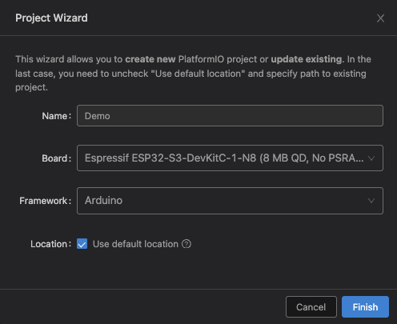

# 水墨屏相册（ESP32-S3 固件）

ESP32-S3 + 7.3 寸 E6 彩色墨水屏（800×480）固件：自建配网、小程序推送拉图、局域网传图。

---

## 硬件清单

| 物料 | 规格 |
| --- | --- |
| 主控 | ESP32-S3 **N16R8**（16MB Flash + 8MB PSRAM） |
| 屏幕 | 7.3 寸 E6 六色电子墨水屏（黑/白/红/黄/蓝/绿） |
| 指示灯 | 板载 WS2812 RGB LED（GPIO 48） |
| 按键 | 3 颗轻触开关（模式 / 执行 / 系统），低电平有效 |

### PCB / 嘉立创打板

板子工程在 [`pcb/`](pcb/)，走嘉立创免费打板：

| 文件 | 用途 |
| --- | --- |
| `Gerber_*.zip` | 上传制板（光板必传） |
| `BOM.csv` + `PickAndPlace.xlsx` | 选 SMT 贴片时一起上传 |
| `InkTime_JLC_EDA.zip` | EDA 源工程，改板用，不下单上传 |

详细说明与下单步骤见 [`pcb/README.md`](pcb/README.md)。

---

## 接线说明

墨水屏走 SPI，按键一端接 GPIO、另一端接 GND。固件已开内部上拉（`INPUT_PULLUP`）。

### 墨水屏 SPI

| 屏幕信号 | ESP32-S3 GPIO | 说明 |
| --- | --- | --- |
| DIN / MOSI | **9** | SPI 数据 |
| SCLK / CLK | **10** | SPI 时钟 |
| CS | **11** | 片选 |
| DC | **12** | 数据/命令 |
| RST | **13** | 复位 |
| BUSY | **14** | 忙信号 |
| VCC | 3.3V | 勿接 5V |
| GND | GND | 共地 |

### 三颗按键

```
GPIO 4 ── 模式键 ── GND
GPIO 5 ── 执行键 ── GND
GPIO 6 ── 系统键 ── GND
```

| 按键 | GPIO | 简要作用 |
| --- | --- | --- |
| 模式键 | **4** | 短按：局域网传图 ↔ 小程序推送 |
| 执行键 | **5** | 未绑定短按查绑定；已绑定双击重刷；长按拉图 / 显示传图地址 |
| 系统键 | **6** | 长按 3s 配网；超长按 8s 恢复出厂 |

> **解绑 / 换绑**：小程序调用 `unbind_ink_frame` 清云端绑定后，设备下次 sync 收到 `bind_qr` 刷绑定页。8s 出厂仅清本地 WiFi/绑定/帧；换绑前应先在小程序解绑。  
> **LED**：下载分包与刷屏期间为**紫色呼吸灯**；未绑定轮询若绑定页 CRC 未变则不重刷墨屏。  
> **全刷观感**：单次全刷会出现闪白 → 负片 → 再清屏 → 定稿，属 E6 硬件波形，正常。

板载 **BOOT / RST** 仅用于烧录与复位，不参与业务按键。

> 引脚与 `platformio.ini` 里 `build_flags` 的 `-DPIN_*` 一致，改线时同步改宏。

---

## 开发环境（PlatformIO）

推荐用 VS Code / Cursor 安装 **PlatformIO IDE** 扩展。

### 新建工程（参考）

若从零创建工程，可用 Project Wizard：



建议配置：

| 项 | 值 |
| --- | --- |
| Board | Espressif ESP32-S3-DevKitC-1（本仓库按 **N16R8** 配置 Flash/PSRAM） |
| Framework | Arduino |

本仓库已含完整 `platformio.ini`，**直接打开本项目目录即可**，不必再新建。

> 向导里若选到 N8（无 PSRAM）版本，与本固件不符。请使用本仓库配置：`board_upload.flash_size = 16MB`、`board_build.arduino.memory_type = qio_opi`。

### 编译与烧录

1. 用 USB 连接开发板，确认串口已识别。
2. PlatformIO：`Build` 编译，`Upload` 烧录。
3. 串口监视波特率：**115200**。

命令行等价操作：

```bash
pio run
pio run -t upload
pio device monitor
```

### 打包产物（发给别人刷机）

编译成功后，文件在：

```
.pio/build/esp32-s3-devkitc-1/
```

通常需要这三个：

| 文件 | 说明 |
| --- | --- |
| `firmware.bin` | 主程序 |
| `bootloader.bin` | 引导 |
| `partitions.bin` | 分区表 |

对方可用 esptool / PlatformIO 烧录；板型与分区需与本项目一致（16MB）。

---

## 上电后怎么用（极简）

1. **首次 / 无 WiFi**：设备开热点 `DayIJoy-心选日`，手机连接后打开配网页（或访问 `http://192.168.8.1/`），填家里 WiFi。
2. 配网成功后可在 `/device` 查看 IP、MAC，并设置服务地址与每日同步整点。
3. **绿灯常亮**：小程序推送模式（默认）；长按执行键立即拉取画面。
4. **青灯常亮**：短按模式键进入局域网传图；长按执行键看屏上地址，浏览器打开 `/upload` 传图。
5. **橙灯慢闪**：配网中；**红灯闪 3 次**：失败提示。

---

## 项目结构（简要）

```
src/main.cpp          # 主流程：配网、按键、sync 调度
lib/epd/              # 墨水屏驱动
lib/wifi_setup/       # AP 配网 + /device 管理页
lib/ink_sync/         # HTTP sync 拉图
lib/frame_store/      # NVS + LittleFS 帧缓存
lib/buttons/          # 三键扫描
pcb/                  # 嘉立创 Gerber / BOM / EDA 源工程（见 pcb/README.md）
platformio.ini        # 板型、引脚宏、依赖
```
