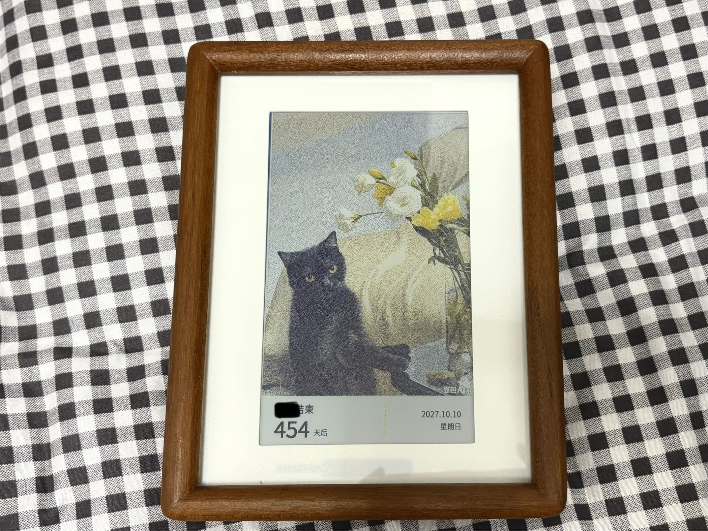
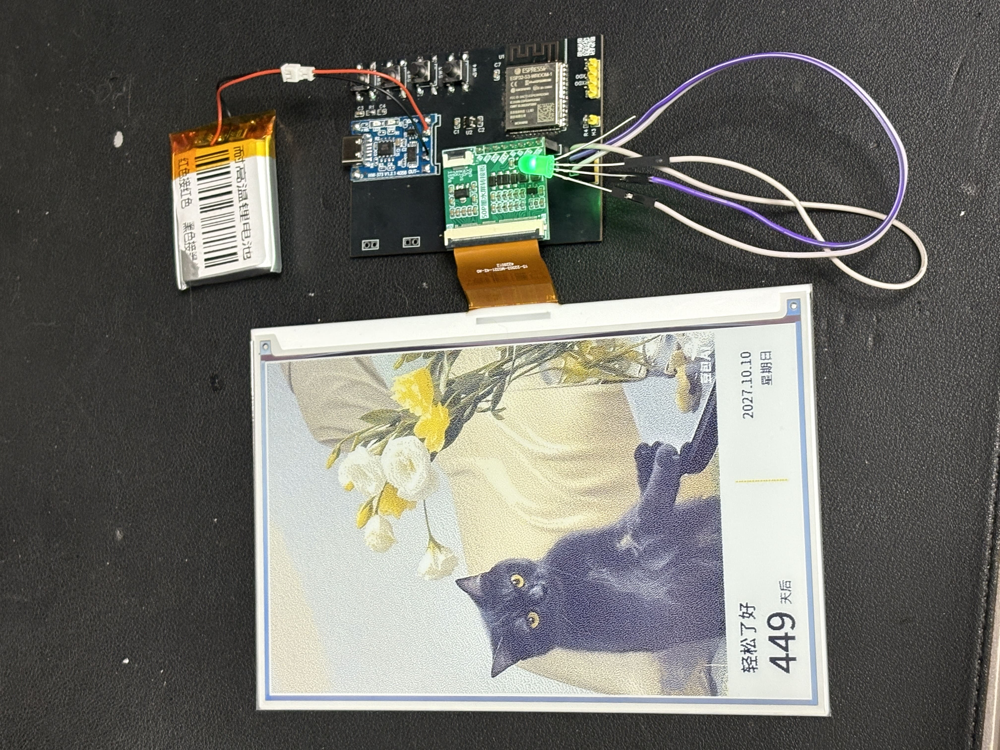
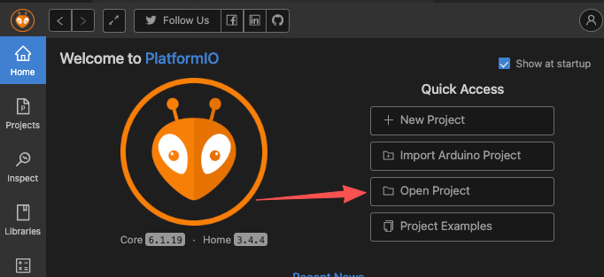

# DayIJoy心选日水墨屏相册（ESP32-S3 固件）

ESP32-S3 + 7.3 寸 E6 彩色墨水屏（800×480）固件：自建配网、微信小程序（DayIJoy心选日）推送拉图、局域网传图。




---

## 硬件清单

| 物料 | 规格 |
| --- | --- |
| 主控 | ESP32-S3 **N16R8**（16MB Flash + 8MB PSRAM） |
| 屏幕 | 7.3 寸 E6 六色电子墨水屏（黑/白/红/黄/蓝/绿） |
| 指示灯 | WS2812 RGB LED（H7 / **GPIO 21**） |
| 按键 | 3 颗轻触开关（模式 / 执行 / 系统），低电平有效 |

### PCB / 嘉立创打板

板子工程在 [`pcb/`](pcb/)，走嘉立创免费打板：

| 文件 | 用途 |
| --- | --- |
| `https://oshwhub.com/backysu/project_tnwtrkia` | 打板地址 |
| `BOM.csv` + `PickAndPlace.xlsx` | 元器件明细 |

---

### PCB元器件明细

| 物料 | 型号/规格 | 备注 |
|------|-----------|------|
| 单片机 | ESP32-S3 N16R8 | — |
| 充电模块 | TP4056 1A 锂电池充电板 | — |
| 转接板 | 咸鱼（记得带马扎） | — |
| C3 | 100nF | — |
| R1 | 10kΩ | — |
| C4 | 1µF | — |
| C1 | 4.7µF | — |
| U2 | MIC5219-3.3YM5-TR | LDO |
| C2 | 10µF | — |
| C7 | 100nF | — |
| R4 | 10kΩ | — |
| C6 | 不接 | 原生USB |
| R2 | 不接 | 原生USB |
| R3 | 不接 | 原生USB |
| C5 | 不接 | 原生USB |

## 接线说明

墨水屏走 SPI，按键一端接 GPIO、另一端接 GND。固件已开内部上拉（`INPUT_PULLUP`）。

### 墨水屏 SPI

| 屏幕信号 | ESP32-S3 GPIO | 说明 |
| --- | --- | --- |
| DIN / MOSI | **9** | SPI 数据 |
| SCLK / CLK | **10** | SPI 时钟 |
| CS | **11** | 片选 |
| DC | **12** | 数据/命令 |
| RST | **13** | 复位 |
| BUSY | **14** | 忙信号 |
| VCC | 3.3V | 勿接 5V |
| GND | GND | 共地 |

### 三颗按键

```
GPIO 4 ── 模式键 ── GND
GPIO 5 ── 执行键 ── GND
GPIO 6 ── 系统键 ── GND
```

| 按键 | GPIO | 简要作用 |
| --- | --- | --- |
| 模式键 | **4** | 双击：预选绿↔青（目标色慢闪）；再单击执行键确认常亮。再双击或约 15s 取消；单击无效 |
| 执行键 | **5** | 未绑定短按查绑定；已绑定双击重刷、短按仅灯闪；长按拉图 / 显示传图地址；下载中再按可取消（未绑定查绑定期间忽略，防连点误停） |
| 系统键 | **6** | 长按 3s 松手：重配 WiFi；超长按 8s：出厂重置（先刷「请先小程序解绑」提示） |

> **解绑 / 换绑**：小程序调用 `unbind_ink_frame` 清云端绑定后，设备下次 sync 收到 `bind_qr` 刷绑定页。8s 出厂仅清本地 WiFi/绑定/帧；**换绑前应先在小程序解绑**（设备出厂前会刷屏提示）。  
> **LED**：下载/刷屏为**紫色呼吸**；系统键按住：0–3s 橙常亮 → 3–6s 黄慢闪（松手即重配）→ 6–8s 红快闪（即将出厂）；取消请求黄闪两下（全刷波形仍无法中断）；断网黄闪并重连，约 5 分钟仍失败则清 WiFi 进配网；局域网模式停留约 10 分钟青灯连闪提醒（双击模式键 + 单击执行键切回）。  
> **开机状态屏**：无缓存刷「初始化中…」；WiFi 慢连/失败刷「WiFi连接中…」「DHCP重试中…」；sync 失败有本地画面时只闪红灯不盖图。  
> **全刷观感**：单次全刷会出现闪白 → 负片 → 再清屏 → 定稿，属 E6 硬件波形，正常。

板载 **BOOT / RST** 仅用于烧录与复位，不参与业务按键。

> 引脚与 `platformio.ini` 里 `build_flags` 的 `-DPIN_*` 一致，改线时同步改宏。

---

## 开发环境（PlatformIO）

推荐用 VS Code / Cursor 安装 **PlatformIO IDE** 扩展。

### 导入工程

本仓库已含完整 `platformio.ini`，用 PlatformIO 直接打开本项目目录即可：



板型为 Espressif ESP32-S3-DevKitC-1（按 **N16R8** 配置 Flash/PSRAM）。请勿改用 N8（无 PSRAM）版本；本仓库配置为：`board_upload.flash_size = 16MB`、`board_build.arduino.memory_type = qio_opi`。

### 编译与烧录

串口监视波特率：**115200**。

若用的是带 USB 口的 ESP32-S3 **开发板**，直接插 USB 即可烧录与监视，不必接 USB-TTL。下面接线说明针对本自制板（无自动下载电路）：用 USB-TTL 接 **H1** 烧录时需手动进下载模式。

**接线（板子已单独供电时）**

| USB-TTL | 板子 H1 |
| --- | --- |
| GND | H1-4 GND |
| TXD | H1-3 RXD0 |
| RXD | H1-2 TXD0 |
| 5V / 3V3 | 不接 |

TTL 跳帽保持 **VCC–3V3**（3.3V 电平）。上传前关掉串口监视器。

**进下载模式后上传**

1. 杜邦线将 **H3（IO0）对地短路**
2. 按一下 **1SW12（复位）**
3. 松开 H3（也可保持接地，传完再松）
4. 立即 `Upload` / `pio run -t upload`

PlatformIO：`Build` 编译，`Upload` 烧录。命令行：

```bash
pio run
pio run -t upload
pio device monitor
```

### 打包产物（发给别人刷机）

编译成功后，文件在：

```
.pio/build/esp32-s3-devkitc-1/
```

通常需要这三个：

| 文件 | 说明 |
| --- | --- |
| `firmware.bin` | 主程序 |
| `bootloader.bin` | 引导 |
| `partitions.bin` | 分区表 |

对方可用 esptool / PlatformIO 烧录；板型与分区需与本项目一致（16MB）。

---

## 上电后怎么用（极简）

1. **首次 / 无 WiFi**：设备开热点 `DayIJoy-心选日`，手机连接后打开配网页（或访问 `http://192.168.8.1/`），点选或**手动输入**家里 WiFi。
2. 配网成功后可在 `/device` 查看 IP、MAC，并设置服务地址与每日同步整点；无缓存时墨屏会显示「初始化完成」与管理页地址。
3. **绿灯常亮**：小程序推送模式（默认）；长按执行键约 2 秒（到点即执行）立即拉取画面。
4. **青灯常亮**：双击模式键预选局域网传图（青灯慢闪），再单击执行键确认常亮；长按执行键约 2 秒刷出 `http://<IP>/upload`，同 WiFi 浏览器打开即可传图（上传后页面会轮询刷屏进度）。
5. **橙灯慢闪**：配网中；**红灯闪 3 次**：失败提示；系统键按住过程见上文 LED 说明。

---

## 微信小程序

设备配网成功后，墨屏会显示绑定二维码。用小程序扫码完成绑定：

**路径**：我的 → 墨屏相框 → 扫码绑定


绑定后可在小程序推送画面；解绑 / 换绑见上文按键说明。

## 项目结构（简要）

```
src/main.cpp          # 主流程：配网、按键、sync 调度
lib/epd/              # 墨水屏驱动
lib/wifi_setup/       # AP 配网 + /device 管理页
lib/ink_sync/         # HTTP sync 拉图
lib/frame_store/      # NVS + LittleFS 帧缓存
lib/buttons/          # 三键扫描
pcb/                  # 嘉立创 Gerber / BOM / EDA 源工程（见 pcb/README.md）
platformio.ini        # 板型、引脚宏、依赖
```
