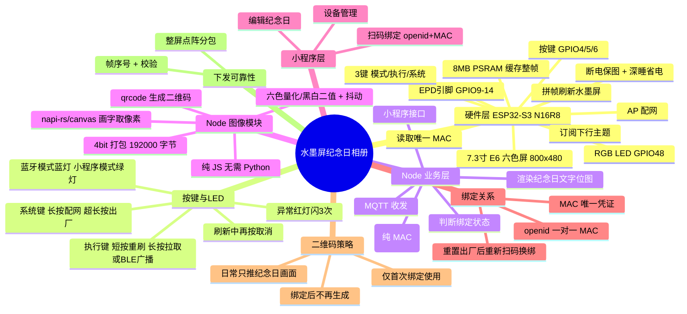

# 水墨屏纪念日相册 · 需求文档总览

小程序 + Node 后端（含图像处理模块）+ ESP32-S3 水墨屏相框的完整联动方案。

本目录已按「软件 / 硬件」拆分为两个子文档，下方为总体设计原则、方案脑图与文档导航。

---

## 📑 文档导航

| 文档 | 内容 |
| --- | --- |
| [硬件方案.md](./硬件方案.md) | 硬件基础、引脚分配、按键与 LED 交互、固件显示端参考、颜色索引对照、刷新防抖、NVS/帧缓存存储、自建配网页、BLE/WiFi 单射频切换 |
| [软件方案.md](./软件方案.md) | 业务全流程、绑定逻辑、MQTT 主题规范、Node 图像处理模块、数据流转、图像算法参考 |

---

## 一、核心设计原则（先明确分工与边界）

1. **二维码只用于「首次绑定」**：设备未绑定时才在屏幕显示绑定二维码；一旦绑定成功，日常只推送纪念日文字画面，**不再重复生成 / 显示二维码**。
2. **全部由 Node 承载**：业务逻辑、MQTT、小程序接口，以及*图像处理*（图像量化 E6 六色 / 黑白二值 + 抖动、图片转点阵字节）全部在 Node 服务内完成，不引入 Python，单一语言单一运行时。图像处理只是 Node 里的一个模块。
3. **ESP32 只做「显示层」**：ESP32 只负责联网、上报 MAC、订阅主题、接收点阵、刷新水墨屏，不做任何图像运算。
4. **利用墨水屏特性**：刷新慢、有残影但**断电保图** → 采用「低频推送 + 收到才刷」，可配合深度睡眠省电。

---

## 二、方案脑图

---

## 三、参考示例代码

现成的官方蓝牙传图示例位于：`docs/7.3寸E6蓝牙传图-示例代码/`

- 图像处理算法（可移植到 Node 图像模块）：详见 [软件方案.md](./软件方案.md) 第六节。
- 固件显示端（ESP32 写显存 + 刷屏）：详见 [硬件方案.md](./硬件方案.md) 第三节。
